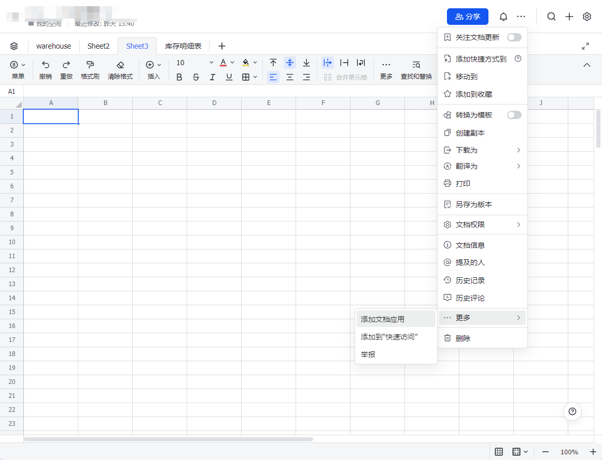
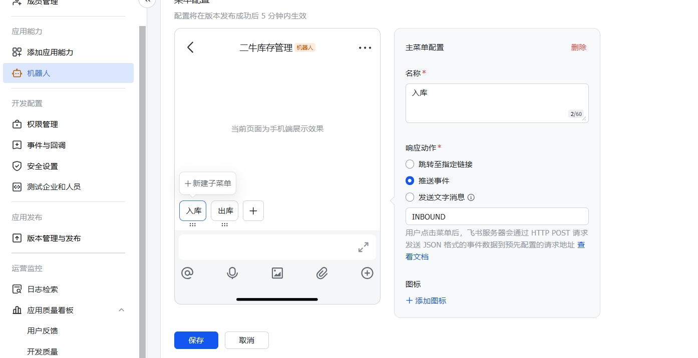

# 二牛库存管理AI助手

基于飞书表格的智能库存管理系统，集成了深度求索 AI 对话功能。
实现纯自然语言对话，无需记忆命令，即可完成商品出入库操作。

## 系统优势
- 🖥️ 本地运行程序，无需服务器和域名，本地一台电脑即可0成本运行，实现多端在飞书进行出入库操作
- 💰 唯一额外成本为按量使用的AI接口调用费用（Deepseek），实现自然语音对话出入库操作
- 🃏 支持通过飞书卡片提交出入库操作，简化流程，且该模式0成本，无需额外成本
- 👥 适合小团队协作管理商品出入库及库存
- 📊 基于飞书表格进行库存数据管理，无需额外搭建数据库
- 🛠️ 可自定义飞书多维表格的可视化拓展，自定义仪表盘等
- 📦 支持商品、仓库、分类等基础信息管理
- 📈 支持商品出入库管理，出库时实时计算单笔利润
- 📉 同一商品不同入库价格时，默认优先出库入库单价高的商品

## 系统劣势
- 🚫 适合小团队使用，不适合大团队，飞书基础团队API调用限制为10000次每月，超过需升级或使用专业版，性价比不明显
- 📉 商品数量超过200不适合，因飞书消息卡片限制，元素超过200会报错，适合商品种类在100左右的业务
- ⚙️ 目前未优化高并发处理，如需高并发需优化代码，当前版本目标为小团队服务

## 配置指南

### 1. 飞书配置

#### 1.1 基础准备
- 下载并安装[飞书](https://www.feishu.cn/)客户端
- 创建新组织或加入已有组织（需要管理员权限）

#### 1.2 应用创建
1. 访问[飞书开放平台](https://open.feishu.cn/) 
2. 点击右上角开发者后台 创建企业自建应用
3. 获取 APP_ID 和 APP_SECRET ，后续在配置文件中需要使用
4. 开启机器人功能

#### 1.3 权限配置
权限配置：（可批量导入）
```json
{
  "scopes": {
    "tenant": [
      "aily:message:write",
      "base:app:update",
      "base:table:create",
      "base:table:read",
      "base:table:update",
      "bitable:app",
      "cardkit:card:write",
      "im:chat",
      "im:message",
      "im:message.group_at_msg:readonly",
      "im:message.group_msg",
      "im:message.p2p_msg:readonly",
      "im:message:readonly"
    ],
    "user": [
      "aily:message:write",
      "base:app:update",
      "base:table:create",
      "base:table:read",
      "base:table:update",
      "bitable:app",
      "im:chat",
      "im:message",
      "im:message:readonly"
    ]
  }
}
```

#### 1.4 事件订阅
1. 加密策略中设置 Verification Token 和 Encrypt Key，后续在配置文件中需要使用
2. 配置定向长链接
这里需要先发一个版本 然后执行一下程序 获取长链接
python环境运行 message_store_bot.py 或 run.py 均可
3. 订阅以下事件：
（第一次运行因为没有配置长链接，可能无法订阅可以先跳过，后续配置后，执行程序自动配置好长链接后，再添加）
   - im.message.receive_v1
   - application.bot.menu_v6

4. 订阅卡片交互回调
   - card.action.trigger


#### 1.5 飞书表格准备
创建并配置以下表格：
可使用模板
https://ccn1hpzj4iz4.feishu.cn/base/DyAYb1D2RaYcbQsjdsdcZOEOnad?table=tblZiGbWquMGu3jB&view=vewHk4ASHw
创建多维表格后会获取表格链接，从链接中获取 app_token 以及 table_id ，后续在配置文件中需要使用
> 📝 **表格链接说明**  
> 示例链接：https://example.feishu.cn/base/MiPBbrxxxxxxxxxxxxxxx?table=tblOxxxxxxxxxxxxxx
> - FEISHU_BITABLE_APP_TOKEN = `MiPBbrxxxxxxxxxxxxxxx` 
> - BITABLE_ID = `tblOxxxxxxxxxxxxxx` 

#### 1.6 添加应用到表格
1. 打开飞书多维表格
2. 点击右上角"添加应用"按钮
3. 在弹出窗口中搜索并选择你创建的应用
4. 确认授权



> ⚠️ **注意**：必须将应用添加到所有相关表格中，否则机器人将无法读写数据


#### 1.7 飞书卡片交互功能
增加了飞书卡片交互功能，可以实现更加复杂的交互操作。需要使用飞书机器人菜单功能，并添加菜单事件处理器。

##### 事件处理器：
- **INBOUND**: 获取入库表单
- **OUTBOUND**: 获取出库表单


### 2. Deepseek 配置

1. 访问 [Deepseek 开放平台](https://platform.deepseek.com/) 注册账号
2. 在开发者控制台创建并保存 API Key

ps: 现在deepseek官网版本比较卡，阿里云百炼 以及 火山引擎 的版本比较稳定，可以考虑使用
只要在env 中 将 DEEPSEEK配置的 DEEPSEEK_BASE_URL 以及 DEEPSEEK_MODEL 的值修改为 阿里云百炼 或者 火山引擎 的地址以及模型即可

## 部署指南

### 1. 环境准备
```bash
# 克隆项目
git clone <项目地址>

# 创建并激活虚拟环境
python -m venv venv
source venv/bin/activate  # Linux/Mac
venv\Scripts\activate     # Windows

# 安装依赖
pip install -r requirements.txt
```

### 2. 环境配置
1. 复制 `.env.example` 为 `.env`
2. 配置以下环境变量：
```
# 飞书应用配置
FEISHU_APP_ID=cli_a7******76100d
FEISHU_APP_SECRET=BZYg***********************pjGG
FEISHU_VERIFICATION_TOKEN=eCBE********************Wgd4
FEISHU_ENCRYPT_KEY=cMt1******************6voTyf

# 飞书多维表格配置
FEISHU_BITABLE_APP_TOKEN=MiPB*****y0enMc
WAREHOUSE_BITABLE_ID=tblY0*****dvUN
PRODUCT_BITABLE_ID=tblVf*****dgKP
INVENTORY_SUMMARY_BITABLE_ID=tblOg*****W00C
INBOUND_BITABLE_ID=tblr6*****XO08
OUTBOUND_BITABLE_ID=tblWj*****Qvu3

# Deepseek 配置
DEEPSEEK_API_KEY=sk-6d0*********************004a
DEEPSEEK_BASE_URL="https://api.deepseek.com"
DEEPSEEK_MODEL="deepseek-chat"
```

## 启动服务

1. 启动前检查：
   - ✅ 飞书应用状态（已上线或测试状态）
   - ✅ 表格权限配置完成
   - ✅ Deepseek API 配置有效
   - ✅ 飞书机器人已添加到目标群组

2.根据自己的需要配置商品表 以及 仓库管理表信息

3. 运行服务：
```bash
python run.py
```

服务将启动：
- 消息存储服务：接收并存储飞书消息
- 消息处理服务：处理库存相关指令

发送消息到飞书群组，或者私聊对应机器人，即可触发机器人处理库存相关指令
也可以在机器人私聊界面获取 入库 以及 出库表单 完成入库 出库操作


