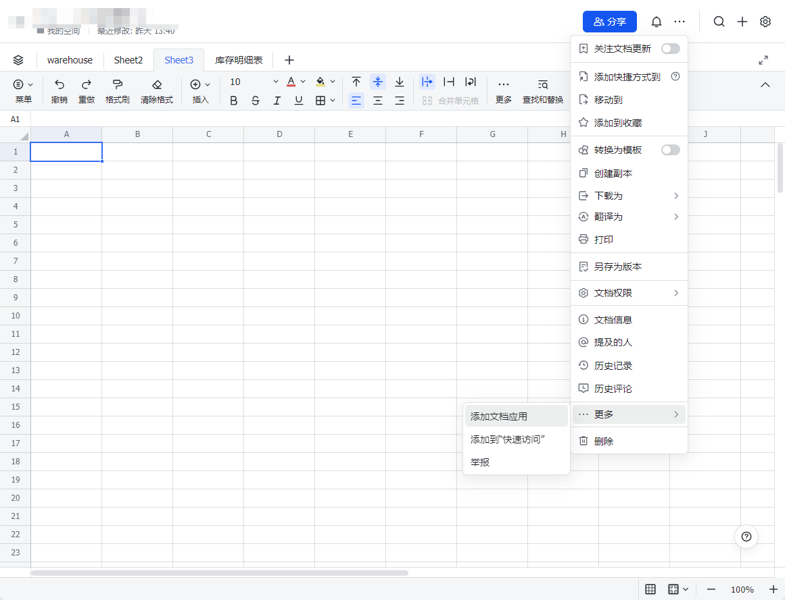

# 库存管理系统

基于飞书表格的智能库存管理系统，集成了深度求索 AI 对话功能。

## 功能特点

- 基于飞书表格的库存数据管理
- 支持商品、仓库、分类等基础信息管理
- 集成深度求索 AI，支持智能对话查询
- 实时消息通知和处理

## 飞书配置

0. 创建/加入飞书组织
   - 下载并安装[飞书](https://www.feishu.cn/)客户端
   - 创建新组织或加入已有组织
   - 确保您拥有创建应用的管理员权限

1. 创建飞书应用
   - 进入[飞书开放平台](https://open.feishu.cn/)创建应用
   - 获取应用的 APP_ID 和 APP_SECRET
   - 在"应用功能"中开启机器人功能
   
2. 配置权限
   - 在"权限管理"中添加以下权限:
     - im:message
     - im:message.group_at_msg
     - im:message.p2p_msg
     - sheet:read
     - sheet:write
     - im:resource  # 机器人消息资源获取
     - im:chat  # 群组信息读取
     - im:chat.member  # 群组成员管理

3. 配置事件订阅
   - 在"事件订阅"页面配置请求网址(Webhook URL) 这里用的长链接 执行一次 message_store_bot.py 后会生成一个长链接
   - 配置验证token和加密key
   - 添加订阅事件:
     - im.message.receive_v1 (接收消息)
     - im.chat.member.bot.added_v1 (机器人被添加)
     - im.chat.member.bot.deleted_v1 (机器人被移除)
   
4. 创建飞书文档和表格
   - 在飞书文档中创建以下表格:
     - 商品信息表(products): 商品名称、SKU、价格等
     - 仓库信息表(warehouses): 仓库名称、地址、分类等
     - 库存记录表(inventory): 入库、出库记录
   - 获取文档的 spreadsheet_token
   - 获取每个表格的 sheet_id
   - 将已创建应用添加到文档中，并赋予权限


## 飞书表格链接说明

以下是飞书表格链接的解析示例：
https://example.feishu.cn/sheets/xxxxxxxxxxxxxxxxxxxxxx?sheet=xxxxxx

- 链接中的 `xxxxxxxxxxxxxxxxxxxxxx` 是文档的 spreadsheet_token
- 链接中的 `xxxxxx` 是表格的 sheet_id

## Deepseek 配置

1. 注册 Deepseek 账号
   - 访问 [Deepseek 开放平台](https://platform.deepseek.com/)
   - 注册并登录账号
   - 进入开发者控制台

2. 创建 API Token
   - 在控制台中选择"API Keys"
   - 点击"创建新的 API Key"
   - 保存生成的 API Key（请妥善保管，仅显示一次）

## 安装

1. 克隆项目
2. 创建虚拟环境：`python -m venv venv`
3. 激活虚拟环境：
   - Windows: `venv\Scripts\activate`
   - Linux/Mac: `source venv/bin/activate`
4. 安装依赖：`pip install -r requirements.txt`
5. 配置环境变量：
   - 复制 `.env.sample` 为 `.env`
   - 配置飞书应用信息:
     ```
     FEISHU_APP_ID=your_app_id
     FEISHU_APP_SECRET=your_app_secret
     ```
   - 配置飞书表格信息:
     ```
     FEISHU_SHEET_TOKEN=your_spreadsheet_token
     PRODUCT_SHEET_ID=product_sheet_id
     WAREHOUSE_SHEET_ID=warehouse_sheet_id
     INVENTORY_SHEET_ID=inventory_sheet_id
     ```
   - 配置深度求索API信息:
     ```
     DEEPSEEK_API_KEY=your_api_key
     DEEPSEEK_BASE_URL=api_base_url
     ```

## 使用

1. 确保配置无误:
   - 飞书应用已上线或处于测试状态
   - 机器人已添加到目标群组
   - 表格已正确授权给应用
   - 深度求索API key 有效且有足够额度
   
2. 运行程序：`python src/main_run.py`
3. 程序会启动两个服务:
   - 消息存储服务：接收并存储飞书消息
   - 消息处理服务：处理库存相关指令